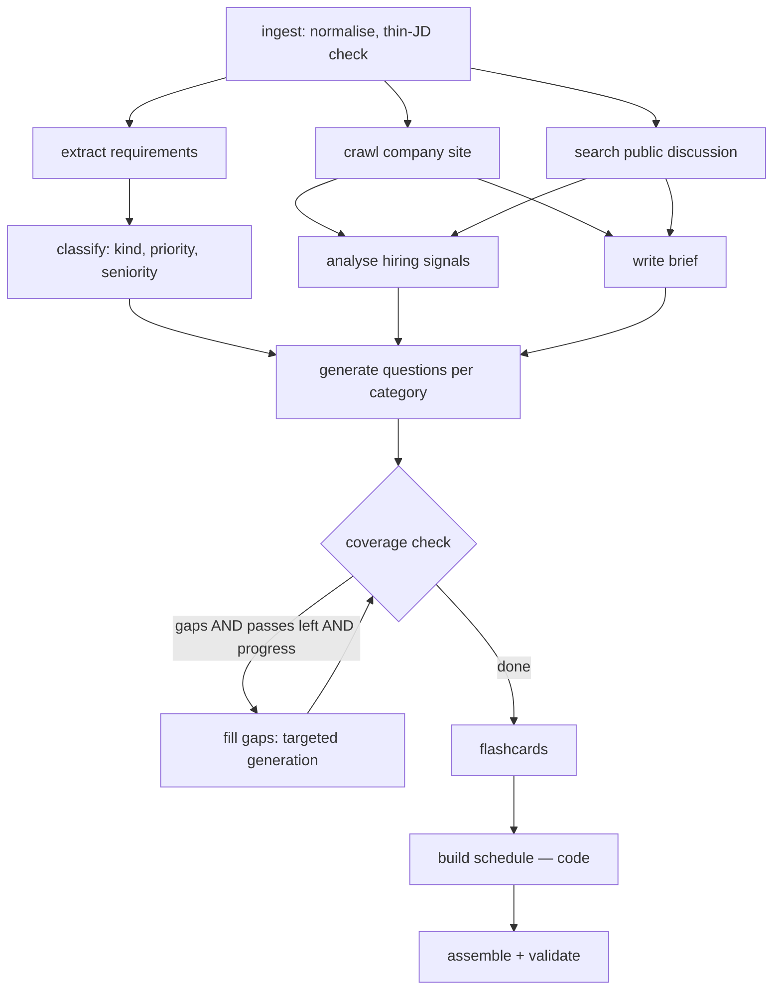

# Architecture — AI Interview Prep Kit

Status: design v1 (2026-09-20). Source of truth for the build; the README will be derived from this.

## 1. Goals and constraints

Turn a pasted job description + company URL + days-available into a structured, editable interview kit (Appendix A of the brief), through a research pipeline that responds to what it finds.

Hard constraints from the brief that shape everything below:

- Kit structure (Appendix A) and batch command (`npm run evaluate -- --input … --output …`) are **exact**.
- Schedule allocation and coverage checking are **deterministic code**, never the model.
- Nothing invented: thin JD → thin kit; unknown company → honest brief.
- Regeneration must never clobber user work.
- Free tiers only; the LLM provider **will** rate-limit us.

## 2. Decision summary

| Area | Decision | Why |
|---|---|---|
| Frontend | Next.js (App Router, TS) + Tailwind + shadcn/ui, hosted on **Vercel** | Native Next support, middleware auth, zero infra |
| Backend | **FastAPI** (Python 3.12), Pydantic v2 | Requested; strong typing + OpenAPI → generated TS types |
| DB | **MongoDB** in a container on the EC2 (EBS volume) | Kit is a nested document; brief's preferred DB |
| Hosting | Vercel (web) → CloudFront (HTTPS only) → **one EC2** running docker compose (`api`, `mongo`) | Long jobs don't fit Lambda/API Gateway limits; cheapest realistic |
| IaC | **Terraform**, flat, local state | One person, one env |
| Deploy | Manual `deploy.sh` (ssh → git pull → compose up --build). No registry, no CI/CD | Simplicity |
| Secrets | `.env` on the instance (chmod 600), never in git/Terraform | Simplicity |
| Generation LLM | Gemini Flash-tier primary, Groq fallback, behind `LLMProvider` | Free tiers, native structured output |
| Decision model | **Jev** (TypeSafe): classify / score / verify | Fast, cheap, typed, calibrated; cannot write text |
| AI framework | **None** (no LangChain/LangGraph) | Fixed pipeline with one bounded loop; plain code makes "what the model doesn't decide" visible |
| Progress | Polling `GET /jobs/{id}` | No idle-timeout failure modes through Vercel/CloudFront |
| Observability | OpenTelemetry in code; **local demo only** (`--profile obs`); off in prod | Show the pipeline in the video without shipping infra |

## 3. System context

```
Browser ─► Vercel (Next.js pages + middleware)
              │  rewrites /api/*  (server-side proxy → first-party cookies, no CORS)
              ▼
           CloudFront (HTTPS terminator for the API, no caching)
              ▼  (HTTP, port 80)
           EC2 ── docker compose
              ├─ api (FastAPI) ─► mongo
              │     ├─► Gemini / Groq        (text generation)
              │     ├─► Jev                  (typed decisions)
              │     └─► company sites, HN API (untrusted retrieval)
              └─ mongo (EBS volume)

Local only:  api ── OTLP/HTTP ─► otel-lgtm (Grafana UI :3001)
CLI:         npm run evaluate ─► same pipeline.run(); no Mongo, no server
```

Key property: **`pipeline.run(case, deps, on_event) -> Kit` is pure orchestration.** It never touches Mongo. The API saves its output; the CLI writes JSON. This is how the batch command runs "the same code the application uses" with zero infrastructure.

## 4. Tech stack

**Frontend:** Next.js, TypeScript, Tailwind, shadcn/ui (Radix — keyboard/ARIA built in), TanStack Query, dnd-kit, react-hook-form + zod, `openapi-typescript` (types generated from the FastAPI OpenAPI schema), Vitest + Testing Library, one Playwright e2e.

**Backend:** Python 3.12, FastAPI, Pydantic v2 + pydantic-settings, PyMongo async (`AsyncMongoClient`; Motor is deprecated), httpx, trafilatura + selectolax (clean text, link extraction), tenacity (retries), aiolimiter (rate limits), argon2-cffi, structlog, `google-genai`, `groq`, `typesafe-sdk`, OpenTelemetry API/SDK + instrumentations. Tests: pytest, pytest-asyncio, respx, hypothesis. Lint/type: ruff, pyright.

**Infra:** Terraform, EC2 (`t3.small` default; `instance_type` is a variable), Elastic IP, CloudFront, AWS Budgets alarm, Docker Compose, Caddy is **not** used.

## 5. Repository layout

```
trao/
├─ package.json            # scripts: setup, dev, test, evaluate (thin wrappers)
├─ .env.example            # every variable documented
├─ README.md
├─ docker-compose.yml      # local: mongo; profile "obs": otel-lgtm
├─ docs/                   # this file, short ADRs
├─ fixtures/
│  ├─ cases.json           # sample batch input
│  └─ sites/               # acme/ (has hiring page), nohiring/ (none), stub JD
├─ scripts/py.mjs          # locates apps/api/.venv python cross-platform
├─ apps/
│  ├─ api/                 # FastAPI (section 6)
│  └─ web/                 # Next.js (section 8)
└─ infra/                  # Terraform + deploy scripts (section 10)
```

`npm run setup` → creates `apps/api/.venv`, `pip install -e apps/api`.
`npm run evaluate -- --input X --output Y` → `node scripts/py.mjs -m app.cli.evaluate` (npm forwards args after `--`).

## 6. Backend

### 6.1 Layers

```
apps/api/app/
├─ main.py                  # create_app(), lifespan, router mounting
├─ config.py                # pydantic-settings — single source of env vars
├─ api/                     # INTERFACE: thin, no business logic
│  ├─ deps.py               # current_user, repo/service providers
│  ├─ errors.py             # exception → {error:{code,message,details,trace_id}}
│  ├─ schemas/              # request/response DTOs
│  └─ routers/              # auth, kits, items, sections, jobs, practice, export, health
├─ domain/                  # PURE — no I/O
│  ├─ kit.py                # Appendix A models (strict enums, StrictInt minutes, difficulty 1..3)
│  ├─ stored_kit.py         # internal doc: items + meta; to_export() strips meta
│  ├─ item_meta.py          # origin / edited / pinned / rev / order / gen_run
│  ├─ ordering.py           # fractional-index keys
│  ├─ merge.py              # regeneration merge rules
│  └─ errors.py
├─ pipeline/                # APPLICATION
│  ├─ orchestrator.py       # sequencing + progress events
│  ├─ context.py, events.py
│  ├─ regeneration.py       # brief / one category / schedule
│  ├─ prompts/              # one file per step, injection-safe framing
│  └─ steps/                # ingest, extract_requirements, classify_requirements,
│                           # crawl_company, research_discussion, analyze_hiring_signals,
│                           # write_brief, generate_questions, coverage_loop,
│                           # generate_flashcards, build_schedule, assemble_kit
├─ retrieval/               # INFRASTRUCTURE (untrusted world)
│  ├─ url_guard.py, safe_fetch.py, robots.py, rate_limiter.py
│  ├─ cleaner.py, link_extractor.py, link_ranker.py, crawler.py
│  └─ discussion/           # hn.py, search_api.py (optional), base.py
├─ llm/                     # base.py, gemini.py, groq.py, router.py, retry.py,
│                           # token_budget.py, structured.py, untrusted.py
├─ jev/                     # client.py, questions.py (typed builders), fallback.py
├─ scheduling/allocator.py  # PURE
├─ coverage/checker.py      # PURE
├─ validation/kit_validator.py
├─ practice/prioritizer.py  # PURE
├─ security/                # passwords.py, sessions.py
├─ jobs/                    # runner.py, idempotency.py, recovery.py
├─ observability/           # setup, tracing, metrics, logging, genai, redaction
├─ persistence/
│  ├─ mongo.py              # client + index creation
│  ├─ repositories/         # users, sessions, kits, jobs, practice, fetch_cache
│  └─ memory/               # in-memory repos for tests/CLI
└─ cli/evaluate.py
tests/  unit/  property/  integration/  conftest.py
```

Dependency rule: `domain`, `scheduling`, `coverage`, `validation`, `practice` import nothing from the rest. `pipeline` depends on interfaces (`LLMProvider`, `Fetcher`, `JevClient`), never on Mongo or FastAPI.

### 6.2 Pipeline



Steps 2–3 (JD analysis) run concurrently with 4–5 (retrieval); they are independent. Question generation waits for all of them because hiring signals change what to ask.

| Step | Responsibility | Model | On failure |
|---|---|---|---|
| ingest | Normalise text, size limits, parse URL, thin-JD flag | code (+ Jev Score for "detail level") | Empty JD → `INVALID_INPUT`; bad URL → recorded warning, continue JD-only |
| extract_requirements | LLM returns `{text, evidence, section_heading}`. **Code verifies `evidence` is a substring of the JD** (whitespace-normalised) and drops anything that isn't. Code assigns ids `r1…rn`, dedupes. Also title/company/location/responsibilities | LLM + code | Retry, one repair call; zero requirements → thin kit, not an error |
| classify_requirements | `kind` (technical/behavioural/domain), `priority` (must/nice), `seniority`. State passed to Jev includes the requirement **and its section heading** ("Bonus points" vs "Required") | Jev; heuristic fallback (keywords: required/must/N+ years vs nice/bonus/preferred/plus) | Low Jev confidence → heuristic |
| crawl_company | Section 6.3 | Jev for link ranking | Failed page skipped and recorded |
| research_discussion | HN Algolia (free, keyless) + optional search API; Jev Noul filters "discusses interviewing at this company" | Jev | Empty → recorded "nothing found" |
| analyze_hiring_signals | Noul flags over hiring pages + discussion: take-home? system-design round? coding round? behavioural round? | Jev | Missing → all flags `unknown`, generic categories |
| write_brief | Company summary/what_they_do/hiring_process **only from fetched text**. If nothing retrieved: **deterministic template, no LLM call** ("We could not retrieve …") | LLM or template | Template |
| generate_questions | One call **per category** with its own prompt, requirement subset and hiring signals (section 6.4) | LLM | Category-level retry; failure recorded, other categories continue |
| coverage_loop | Section 6.5 | code + LLM | Ships with `uncovered_requirement_ids` populated |
| generate_flashcards | One call from must-requirements + technical questions | LLM | Fewer/no cards + warning |
| build_schedule | Section 6.6 | **code only** | — |
| assemble_kit | Pydantic + semantic validation (section 6.9) | code | Invalid → `KIT_INVALID` (see 6.10) |

**Role of each model.** The LLM writes prose; Jev makes decisions; code makes the two decisions the brief reserves (schedule, coverage). Jev reads instructions literally, doesn't infer context, and doesn't defend against adversarial input — so it is used as a detector/classifier, never as the security boundary.

### 6.3 Retrieval

- **Crawler:** priority-queue BFS from the company URL. Budget: `MAX_CRAWL_PAGES` (default 12), depth ≤ 2, ≤ 3 concurrent fetches, ≤ 1 request/second per host. Follows **relative links**; never assumes a host (fixture sites are served from localhost).
- **Link ranking:** for each discovered link, Jev scores "likely describes how this company hires or what it does" from `{anchor text, URL path, surrounding text}`. Cheap, parallel, 70–500 ms. Fixed path lists (`/careers`) are **not** used as the mechanism; they may only seed nothing.
- **Page typing:** Jev Choice — `hiring_process | about | product | engineering_blog | other`. Hiring/about pages are kept for the brief; others dropped.
- **Cleaning:** trafilatura main-content extraction, capped per page and in total (token budget).
- **`robots.txt`:** fetched once per host, honoured; disallowed URLs are skipped and recorded with reason `robots`.
- **Failures:** timeouts, 4xx/5xx, wrong content type, oversize → retry with exponential backoff + jitter (max 3), then skip and record `{url, reason}` in `research_log`. **One dead source never fails the run.**
- **Cache:** `fetch_cache` (Mongo TTL) keyed by URL — retries and regenerations don't re-fetch.
- **Sources used (for README):** the company's own site; Hacker News via Algolia API; optional search API if `SEARCH_API_KEY` is set. Glassdoor/LinkedIn are not scraped (terms + blocking).

### 6.4 Question generation

Categories: `technical`, `behavioural`, `system-design`, `company-fit`.

Routing by requirement `kind`:

- `technical` → `technical`; also `system-design` if Jev Noul says the requirement concerns design/architecture/scale.
- `behavioural` → `behavioural`.
- `domain` → `technical`; also `company-fit` when hiring/brief evidence exists.

Gating (to avoid inventing filler): a category with no routed requirements is **skipped**, not padded. `company-fit` requires retrieved company evidence. Every question must reference ≥ 1 requirement id. Question count per category ≈ `clamp(2 × routed_reqs, 1, 10)`; thin JD → fewer.

Hiring signals modify prompts: `has_take_home` → questions on scoping/trade-offs of a take-home; `has_system_design_round` → forces the system-design category on for eligible requirements.

Each question also gets `difficulty` (Jev Score → 1–3 rounded) and, as an extension, `outline_points[]` (discrete checkable points; `answer_outline` remains the required prose field).

### 6.5 Coverage loop (the second pass)

```
coverage_map   = {req_id: [question ids]}          # from question.requirement_ids
verified_links = drop links where Jev Noul("question tests requirement") < 0.3
gaps           = all_req_ids − ⋃ verified_links.requirement_ids     # set difference, code
blocking_gaps  = gaps ∩ must_ids
```

- Pass 1 = initial generation + check. Up to **2 gap-fill rounds** → max 3 passes. `coverage.passes` records checks performed.
- A gap-fill round generates only for the gap ids, routed by `kind` as above, with existing prompts passed as an exclusion list.
- **Stop when:** no gaps, or cap reached, or **no progress** (identical gap set two rounds running — the model can't or won't cover it).
- **Why 3:** the first pass covers the bulk; the second targets what's left with a narrow prompt; a third is a last forced attempt for `must` gaps only. Beyond that, returns diminish and the token budget is better spent elsewhere. Anything still uncovered ships **honestly listed** rather than papered over.
- Jev only *removes* dubious links (mislabelled `requirement_ids`). The gap decision itself is set arithmetic in code, as the brief requires.

### 6.6 Schedule allocation (pure, `scheduling/allocator.py`)

Inputs: questions, requirements, `days`. Output: exactly `days` day objects with integer `minutes`.

1. **Weight:** `w(q) = difficulty × max(priority_weight of covered reqs)`, `must = 2`, `nice = 1`. Sort by `w` desc; ties by category order then id (deterministic).
2. **Minutes:** integer lookup by `(category, difficulty)`, e.g. technical 10/15/20, behavioural 8/10/12, system-design 20/30/40, company-fit 6/8/10.
3. **If `Q ≥ N`:** front-loaded triangular split. Day `i` (1-based) targets `W × (N − i + 1) / (N(N+1)/2)` of total weight; walk the sorted list filling day 1, then day 2, … each day gets ≥ 1 question. Hard/high-priority material lands early; the final day is the lightest.
4. **If `Q < N`** (e.g. 60 days): each question gets its own day in weight order; remaining days are **spaced-review days** that repeat the highest-weight questions at expanding intervals (+1, +2, +4 days). `question_ids` may repeat across days; every day still has ≥ 1 id.
5. **`N = 1`:** everything on day 1; minutes are reported honestly (no clamping).
6. **Zero questions** (very thin JD): `N` days still emitted, `question_ids: []`, `minutes: 0`, focus explains why.
7. **Focus label:** deterministic template from the day's top-weighted question (`"Day 2 — system-design: <top requirement text>"`).
8. **Invariants (property-tested):** `len(days) == N`; all ids integers; every schedule `question_id` exists; every question appears ≥ 1 time, so every *covered* must-requirement appears by construction.

### 6.7 Practice

- Card state (own collection, keyed by `flashcard_id`, **not** part of the kit): `reviews[]` = `{confidence 1–3, at}`.
- `confidence_norm = (c − 1)/2`; unseen cards use `0.25` (new material before mastered material, after known-weak).
- `priority = (1 − confidence_norm) + 0.1 × min(hours_since_review / 24, 3) + 0.15 × [card covers a must requirement]`. Sort desc → next session (default 10 cards).
- **Covered** = reviewed at least once. Summary by category and by requirement.
- **Why not SM-2:** a prep window is days long; SM-2's 1-day/6-day intervals exceed the horizon. A confidence-weighted sort with recency decay is simpler and fits.

### 6.8 Jobs (slow, external, failure-prone)

- `POST /kits` validates, computes `dedupe_key = sha256(user + normalised JD + normalised URL + days)`, and:
  - existing kit with same key → returns it (`200`, `duplicate: true`); `force_new` overrides;
  - else creates kit `status=generating` + job → `202 {kit_id, job_id}`.
- In-process asyncio runner; `MAX_CONCURRENT_RUNS` (default 2) semaphore. Job doc holds `steps[] = {name, status: pending|running|done|skipped|failed, message, started_at, finished_at}` and a `heartbeat` (every 5 s).
- **One active job per kit** (partial unique index); triggering again returns the existing job.
- **Recovery:** on startup, jobs with a stale heartbeat are marked `failed (retryable)`. Retrying re-runs the pipeline; crawling is fast via `fetch_cache`.
- **Partial results:** a failed *step* is recorded; independent later steps still run where possible. The kit is `ready` with `warnings` unless it can't be validly assembled.
- Assumes a **single instance** (documented limitation).

### 6.9 Validation

Two layers before saving: (1) Pydantic strict models for Appendix A; (2) semantic validator — unique ids, every `requirement_ids`/`question_ids` reference exists, `len(schedule.days) == days_available`, all `minutes` are ints, difficulty 1–3, no `must` requirement absent from both coverage map and `uncovered_requirement_ids`. Also exports `fixtures/kit.schema.json` from the models for contract tests.

### 6.10 Error model and batch semantics

API errors: `{error: {code, message, details, trace_id}}`. `trace_id` is the OTel trace id when telemetry is on, else a request id (always generated), so the UI's "Reference: …" line works in prod.

Batch `status: "failed"` is reserved for cases where **no valid kit could be produced**: `INVALID_INPUT` (empty JD), `LLM_UNAVAILABLE` (all providers exhausted, nothing generated), `KIT_INVALID` (couldn't assemble a valid kit after repair), `TIMEOUT` (per-case deadline hit before a valid kit existed).

**Decision:** an unreachable/404/invalid company site is **`ok`** with the failure recorded in `research_log` and an honest brief — the brief's Robustness criterion says "unreachable sites are recorded rather than fatal", and the FAQ reserves `failed` for "could not produce a kit at all". (Appendix B's example uses `COMPANY_UNREACHABLE` as a failure; this is the one ambiguity to be aware of. The code is defined but only used if we choose to treat unreachable as fatal.)

Batch performance: 2 cases concurrently, global LLM limiter shared, per-case deadline 240 s (5 cases ≈ 3 rounds ≤ 15 min worst case). On deadline, a valid partial kit is returned as `ok` with warnings; otherwise `TIMEOUT`.

### 6.11 LLM layer

- `LLMProvider` protocol: `generate_structured(prompt, schema) -> Model`. Implementations: Gemini, Groq. `router.py` tries in order.
- **Rate limits:** token-bucket limiter per provider (RPM + TPM). On 429/5xx: honour `Retry-After`, else exponential backoff with jitter (base 2 s, cap 60 s, max 4 attempts), then fail over to the next provider.
- **Structured output:** use native JSON-schema mode where available → Pydantic validate → **one** repair call including the validation error → else step failure.
- **Token budgeting:** page/JD text is truncated per prompt to a budget so no single call exceeds provider TPM.
- Model names come from env (`GEMINI_MODEL`, `GROQ_MODEL`); pick the current Flash-tier / 70B-class models at build time.
- Jev client wraps `typesafe-sdk`; every call has a heuristic/LLM fallback and `JEV_ENABLED=false` switches it off entirely.

### 6.12 Security (kept proportionate)

- **URL guard (`url_guard.py`):** http/https only; resolve DNS and reject private, loopback, link-local (incl. `169.254.169.254`) and reserved ranges **when `ENV=production`**; re-validate on every redirect hop (max 3). Default `ENV` is `development`, so the CLI works against localhost fixture sites from a clean clone. Residual risk: DNS rebinding between check and connect (documented).
- **Fetch limits:** content-type allowlist (`text/html`, `text/plain`, `application/xhtml+xml`), streamed size cap (2 MB), connect 5 s / total 15 s timeouts.
- **Prompt injection:** JD and page text are wrapped in delimited blocks the prompt declares to be *data*; the LLM has no tools and its output is schema-validated; requirement `evidence` must exist in the JD; Jev Noul flags "text addresses an AI / contains instructions" → page is dropped and logged. Detection is a signal, not the boundary.
- **Auth:** argon2id; opaque 256-bit session token, only its SHA-256 stored in Mongo (`sessions`, TTL index, 7 days); cookie `httpOnly; Secure; SameSite=Lax`, first-party via the Vercel rewrite. Mutating requests require `Origin ∈ ALLOWED_ORIGINS`. In-memory login rate limit per IP+email. Every kit query is filtered by `user_id`; other users' kits return `404`.
- **Secrets:** `.env` on the instance, gitignored. Nothing secret in Terraform.
- Not doing (out of scope / accepted): email verification, password reset, roles, CloudFront→EC2 TLS, secret manager.

### 6.13 API surface

```
POST   /api/auth/register | login | logout        GET /api/me
POST   /api/kits                       (202 {kit_id, job_id}; idempotent)
POST   /api/kits/batch                 (JSON/CSV of {jd, company_url, days})
GET    /api/kits            GET|DELETE /api/kits/{id}
GET    /api/kits/{id}/export           (Appendix A projection)
GET    /api/jobs/{id}
PATCH|POST|DELETE /api/kits/{id}/{questions|flashcards|requirements|brief|schedule}/…
POST   /api/kits/{id}/questions/reorder      {id, category, after_id}
POST   /api/kits/{id}/sections/{brief|questions:<category>|schedule}/regenerate
GET    /api/kits/{id}/practice/queue         POST …/practice/reviews    GET …/practice/summary
POST   /api/kits/{id}/practice/check         (creative feature, 7)
GET    /api/health
```

## 7. State model: generated, edited, pinned

The hardest problem in the brief. Appendix A stays clean; state lives in an internal document and is stripped on export.

```
item = { id, …Appendix A fields…,
         meta: { origin: "generated" | "user",
                 edited: bool, pinned: bool,
                 rev: int, order: "<fractional index>",
                 gen_run: "<run id>" | null, updated_at } }
```

**Protected** = `origin == "user" || edited || pinned`. Protected items are never removed or overwritten by regeneration.

| Action | Effect |
|---|---|
| Pipeline creates item | `origin=generated, edited=false, pinned=false` |
| User edits any content field, or **moves it to another category** | `edited=true`, `rev++` |
| User adds an item | `origin=user` |
| User toggles pin | `pinned` flips |
| Reorder within a category | `order` only (does not protect the item) |
| Delete | removed; schedule references removed immediately for integrity |

**Regenerating a category:** victims = unprotected items in that category. Generate replacements for the category's routed requirements, passing protected prompts as an exclusion list (no duplicates; target count = normal − protected). Commit as **one atomic single-document pipeline update** (`$set: { questions: { $concatArrays: [ { $filter: … keep protected and any item whose rev changed since the job started … }, newItems ] } }`) — works on standalone Mongo, no transactions. An edit that lands while the job is in flight bumps that item's `rev`, so it survives. Coverage is then recomputed over kept + new.

**Brief (single object):** if untouched, regeneration applies directly; if `edited`/`pinned`, it returns a **proposal** the user accepts or rejects.

**Schedule:** derived state. Manual edits (focus text, moving question ids between days) are allowed and preserved. When questions change the schedule is marked `stale` with a banner and a **Rebuild** action (warns that manual schedule edits are replaced). Deleted question ids are stripped immediately.

**Ordering:** fractional-index strings, so a drag writes one item, not the list; the frontend mirrors the algorithm so reorder is instant.

**Practice progress** lives in its own collection keyed by flashcard id, so regeneration never wipes it.

Mongo collections: `users`, `sessions` (TTL), `kits`, `jobs`, `practice_progress`, `fetch_cache` (TTL). A kit is one document: `{ user_id, dedupe_key, status, input:{jd, company_url, days}, kit:{…Appendix A + meta…}, research_log, sections_rev, timestamps }`. `research_log` = pages tried/skipped with reasons, discussion outcome, `thin_jd`, `warnings[]`. Extensions to Appendix A (all optional, core fields untouched): `research_log`, `company_brief.hiring_process`, `question.outline_points`.

## 8. Frontend

```
apps/web/
├─ next.config.ts          # rewrites /api/* → API_ORIGIN
├─ middleware.ts           # cookie check → redirect to /login
└─ src/
   ├─ app/
   │  ├─ (public)/login, register
   │  ├─ (app)/layout.tsx                 # auth shell + nav
   │  ├─ (app)/kits/page.tsx              # list + empty state
   │  ├─ (app)/kits/new/page.tsx          # single | batch upload tabs
   │  ├─ (app)/kits/[kitId]/layout.tsx    # header, tabs, generation banner
   │  ├─ (app)/kits/[kitId]/{page,role,questions,flashcards,schedule,practice,print}/
   │  └─ error.tsx, not-found.tsx, loading.tsx
   ├─ features/               # each: components/ hooks/ api.ts
   │  ├─ auth  kits  generation  brief  role
   │  ├─ questions   # QuestionBoard, CategoryColumn, QuestionCard, QuestionEditor, OriginBadge, RegenerateButton
   │  ├─ flashcards  schedule  coverage  practice
   ├─ components/
   │  ├─ ui/          # shadcn primitives
   │  └─ feedback/    # EmptyState, ErrorState, Skeletons, Toaster
   ├─ lib/
   │  ├─ api/         # client.ts (credentials, error envelope, 401 → /login), generated/ types
   │  ├─ query/       # keys.ts, client.ts
   │  └─ ordering.ts  # mirror of backend fractional index
   └─ hooks/          # useItemMutationQueue, useDebouncedField, useHotkeys
```

**State boundaries:** server state in TanStack Query (`['kit', id]`); UI state local to the feature; forms via react-hook-form + zod.

**Editing feels immediate:** edits apply to the query cache optimistically; text fields debounce (~600 ms) and per-item mutations are serialised so two edits never race; each item shows *Saving… / Saved / Failed — retry*. Failure rolls back with a toast; a `rev` conflict refetches and says what changed.

**Generation UX:** polls `/jobs/{id}` every 1.5 s (backing off to 5 s, paused when the tab is hidden). Step list shows pending/running/done/**skipped (with reason)**/failed. Terminal states: success; success-with-warnings (banner listing skipped sources and any uncovered requirements); failure (message, retry button, reference id). Skeletons while loading; purposeful empty states (no kits yet; empty category; no flashcards yet).

**Regeneration UX:** only unprotected items in the section dim and show progress; protected items stay live and editable throughout. Origin badges: *AI*, *Edited*, *Yours*, *Pinned*.

**Reordering & a11y:** dnd-kit pointer + keyboard sensors, **plus** an explicit "Move up / down / to category…" menu per question as an accessible alternative. Visible focus rings, ARIA live region for save/regen status. Practice: keyboard shortcuts (space = reveal, 1/2/3 = confidence).

**Responsive:** phone — tabs collapse to a select, category columns become an accordion, cards full-width; laptop — columns.

**Contract:** TS types generated from the FastAPI OpenAPI schema; the UI never hand-writes response types.

## 9. Observability (local demo only)

The code exists; **deployment does not use it.** `observability/setup.py` initialises providers only if `OTEL_EXPORTER_OTLP_ENDPOINT` is set — otherwise a no-op, so `npm run evaluate` runs from a clean clone with nothing running. Exporters are asynchronous and never fail or slow a run.

```yaml
# docker-compose.yml
otel-lgtm:
  profiles: ["obs"]
  image: grafana/otel-lgtm
  ports: ["3001:3000", "4318:4318"]   # Grafana UI, OTLP/HTTP
```

```bash
docker compose --profile obs up -d
OTEL_EXPORTER_OTLP_ENDPOINT=http://localhost:4318 npm run evaluate -- --input fixtures/cases.json --output out.json
# Grafana → http://localhost:3001 → Explore → Tempo
```

**Instrumentation:** auto for FastAPI, httpx, PyMongo. Custom spans: root per pipeline run (`case_id`, `kit_id`); child per step with attributes (`pages_fetched`, `coverage.pass`, `uncovered_count`); each crawl fetch (host, status, bytes, robots decision, skip reason); each LLM call (`gen_ai.*`: provider, model, input/output tokens, latency, retries, 429, fallback); each Jev call (question type, latency, confidence). Metrics: LLM tokens/requests by provider+outcome, rate-limit hits, pipeline duration/outcome, fetch outcomes, coverage passes, active jobs.

**Decisions:** background jobs start a **new root span with a span link** to the originating request (the request span ends long before the job); `trace_id` stored on the job doc. **Redaction:** spans carry lengths and hashes, never JD or page text (`DEBUG_CAPTURE_CONTENT=true` opts in locally). Logs: structlog JSON to stdout with trace/span ids, Docker log rotation on the instance.

## 10. Infrastructure and deployment (built last)

```
infra/
├─ terraform/
│  ├─ main.tf              # key pair, security group, EC2, EIP, CloudFront, budget alarm
│  ├─ variables.tf         # my_ip, public_key_path, instance_type, repo_url
│  ├─ outputs.tf           # cloudfront_url, ec2_ip
│  ├─ versions.tf
│  └─ terraform.tfvars.example
└─ deploy/
   ├─ docker-compose.prod.yml   # api, mongo (no telemetry)
   ├─ bootstrap.sh              # user_data: install docker, 2 GB swap, clone repo
   └─ deploy.sh                 # ssh → git pull → docker compose up -d --build
```

- **Default VPC**, no NAT. Security group: 22 from `my_ip`, 80 open.
- **CloudFront:** one behaviour, caching disabled, all cookies/headers/query forwarded, origin = EC2 :80. Gives HTTPS on `*.cloudfront.net` (required for `Secure` cookies). Origin response timeout (30 s) is fine because all requests are short — long work is a background job read by polling.
- **Vercel:** link repo, Root Directory `apps/web`, env `API_ORIGIN=<cloudfront url>`. Git push auto-deploys.
- **EC2:** `t3.small` (2 GB) + 2 GB swap; Mongo `--wiredTigerCacheSizeGB 0.25`. `t3.micro` is possible but tight; it's a variable.
- **Secrets:** `scp .env.prod ec2:trao/.env`, `chmod 600`.
- **State:** local Terraform state (gitignored) — back it up.
- **Cost guard:** `aws_budgets_budget` alarm. Verify what your AWS account's free plan/credits cover.
- **Verify after first deploy:** Vercel rewrite forwards `Set-Cookie` and the `Origin` header intact (CSRF check), and `ALLOWED_ORIGINS` matches the Vercel domain.

## 11. Configuration

| Var | Where | Purpose |
|---|---|---|
| `ENV` | api | `development` (default) or `production`; controls the private-URL block |
| `ALLOW_PRIVATE_URLS` | api | explicit override of the URL guard |
| `MONGODB_URI` | api | database |
| `SESSION_SECRET` | api | signing/hashing key for sessions |
| `ALLOWED_ORIGINS` | api | CSRF Origin check |
| `GEMINI_API_KEY`, `GEMINI_MODEL` | api, CLI | primary generation |
| `GROQ_API_KEY`, `GROQ_MODEL` | api, CLI | fallback generation |
| `TYPESAFE_API_KEY`, `JEV_ENABLED` | api, CLI | Jev decisions (fallbacks when off) |
| `SEARCH_API_KEY` | api, CLI | optional public-discussion search |
| `MAX_CRAWL_PAGES`, `CRAWL_DEPTH`, `MAX_CONCURRENT_RUNS` | api, CLI | budgets |
| `OTEL_EXPORTER_OTLP_ENDPOINT`, `OTEL_SERVICE_NAME`, `DEBUG_CAPTURE_CONTENT` | api, CLI | local telemetry demo only |
| `API_ORIGIN` | web (Vercel) | rewrite target |

The CLI needs only the LLM/Jev keys. All documented in `.env.example`.

## 12. Testing strategy

- **Unit (must-have per brief):** allocator, coverage checker, kit validator; plus merge rules, fractional ordering, url_guard, prioritizer, evidence-substring verification.
- **Property (hypothesis):** for any `Q`, `N`, priorities → `len(days) == N`, integer minutes, all ids valid, all questions scheduled, hard/high-priority not later than lighter items when `Q ≥ N`.
- **Integration:** full `pipeline.run` with a `FakeLLM` and fixture sites on an ephemeral localhost server: `acme/` (buried hiring page), `nohiring/` (none), 404 site, timeout site, plus a two-line JD, invalid-JSON LLM output, 429 storm, and a second-pass case where the fake LLM initially misses a `must`.
- **Contract:** every produced kit validates against `fixtures/kit.schema.json`; batch output validates against Appendix B.
- **Frontend:** Vitest for optimistic-edit/reorder hooks and error states; one Playwright e2e (register → create → edit → regenerate preserves edit).
- No CI service (deliberately); `npm test` runs everything locally.

## 13. Brief §10 edge cases → behaviour

| Edge case | Behaviour |
|---|---|
| Company URL invalid / 404 / timeout | Retry ×3, record in `research_log`; kit `ok`, brief from template, `pages_used: []` |
| No hiring/about page found | Recorded; generic category mix, no hiring-specific questions |
| Two-line JD | `thin_jd`; few requirements, no padding, kit says so (`warnings`) |
| No public discussion | Recorded "nothing found"; brief says so |
| Invalid JSON / incomplete kit | Repair call → targeted regeneration → `KIT_INVALID` only if still unusable |
| Provider rate-limits or fails | Backoff + Retry-After → fallback provider → step failure recorded |
| Same JD + company submitted twice | Same `dedupe_key` → existing kit returned; `force_new` to override |
| 1-day / 60-day schedule | Always exactly N days (section 6.6) |

## 14. Creative feature: practice answer check

**Problem:** candidates practise answers but can't tell if they're any good.
**Feature:** in Practice, the user types an answer to a question. For each `outline_points[i]`, one Jev Noul ("the answer addresses: …") runs in parallel (<500 ms total) and returns a calibrated verdict → a checklist of covered / missing points. No extra LLM tokens.
**Limits (stated in the UI):** Jev reads literally and won't credit implied points; it's a coverage check, not a quality judgment.

## 15. Risks and open items

1. **FastAPI vs the brief.** The brief mandates `npm run evaluate` and says "JavaScript or TypeScript only" in §14, while §1 allows equivalent stacks with an explanation. Mitigation: root `package.json` wrapper + `npm run setup`, documented prominently. Residual risk: a grader on a machine without Python 3.12. **Recommend confirming with Trao in writing.**
2. **Jev free tier unverified** (priced at $0.042/M input tokens). Everything degrades to heuristics/LLM with `JEV_ENABLED=false`.
3. **Free-tier LLM limits change.** Provider abstraction + limiter + fallback; verify limits at build time.
4. **Unreachable-company semantics** (6.10) — one-line switch if graders expect `COMPANY_UNREACHABLE`.
5. **Single instance:** in-process jobs die with the process (recovery marks them retryable); Mongo backups are manual.
6. **Known gaps (accepted):** DNS-rebinding window, CloudFront→EC2 plaintext hop, no secret manager, no CI.

## 16. Build order

1. `domain/`, `scheduling/`, `coverage/`, `validation/`, `practice/` with tests (unit + property).
2. Pipeline + `FakeLLM` + CLI + fixture sites; OTel spans added as steps are written.
3. Real LLM/Jev adapters, crawler, discussion search.
4. API: auth, jobs, kits, items, regeneration merge.
5. Frontend: generation progress → builder → practice → answer check.
6. Terraform, deploy, README, walkthrough video.

Time-box infra to ~½ day; fallback is the same compose file on a bare EC2.
